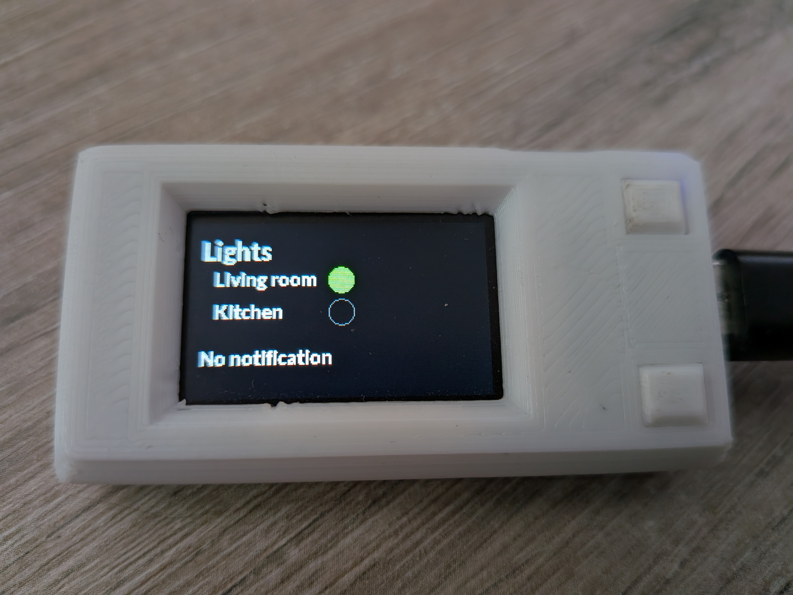
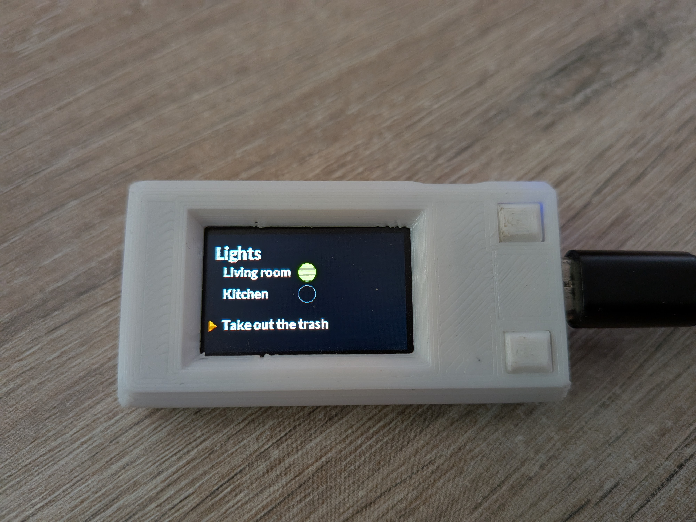

# Home-Assistant TTGo display

 

## ESPHome

Configuration for ESPHome with the following devices:

- [TTGO-TDisplay ESP32](https://fr.aliexpress.com/item/33050639690.html?spm=a2g0o.order_list.order_list_main.11.6cb75e5bBN2YKX&gatewayAdapt=glo2fra)

- [3D-Printed case](https://www.thingiverse.com/thing:4501444)

### TTGO-TDisplay Configuration

This configuration creates a status display for your smart home using the TTGO T-Display ESP32 device.

#### Features

- **Light Status Display**: Shows the on/off status of two light groups ("Salon" and "Cuisine")
- **Notifications**: Displays messages from Home Assistant through a dedicated text input entity
- **Physical Buttons**: Two buttons that can be integrated with Home Assistant automations
- **Clean UI**: Uses custom fonts and graphics for better readability

#### Home Assistant Integration

The device integrates with Home Assistant using:

1. **Light Status**: Shows real-time status of two light entities:
   - `light.light_group_salon`: Living room light group
   - `light.ampoule_cuisine`: Kitchen light

2. **Notifications**: Displays messages from the `input_text.ttgo_logger` entity

3. **Buttons**: Both physical buttons send events to Home Assistant when pressed:
   - Button 0 (bottom): Short press triggers an event
   - Button 1 (top): Short press triggers an event

#### Setup Requirements

1. Create an `input_text.ttgo_logger` entity in Home Assistant for sending messages
2. Ensure your light entities match those in the configuration

#### Hardware Connections

The configuration uses the standard TTGO T-Display pins:
- Display SPI: GPIO18 (CLK), GPIO19 (MOSI)
- Display control: GPIO5 (CS), GPIO16 (DC), GPIO23 (RST), GPIO4 (Backlight)
- Buttons: GPIO0 (Bottom), GPIO35 (Top)

#### Future Enhancements

- Create multi-page interface for different smart home
- Use an e-ink display to reduce energy consumption and have it available with battery

